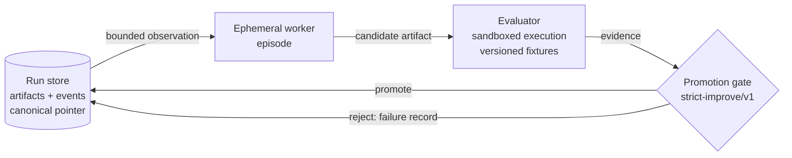

# stigmergic-dev-runtime

[](https://github.com/rayvoidx/stigmergic-dev-runtime/actions/workflows/ci.yml)
[](LICENSE)
[](pyproject.toml)

The public, reproducible research kernel of a **human-governed Agentic
Engineering OS**, centered on evaluator-gated stigmergic software evolution.

**Thesis.** *Persistent projects, ephemeral agents:* finite-lived AI workers can
accumulate useful software capability through versioned executable artifacts,
lineage, evidence, and failure records — without depending on persistent
conversational identity.

In the thesis-defining `artifact_only` condition, workers never talk to each
other. Coordination happens only through shared project state: the canonical
artifact, its lineage, evaluator evidence, and the recorded failures of earlier
(now gone) workers. The other conditions exist to test this restriction.

## Research questions

- **RQ1** Under matched inference and tool budgets, does artifact-mediated
  coordination outperform a single persistent agent and isolated best-of-N on
  continuous software-evolution milestones?
- **RQ2** How much useful coordination remains when direct agent communication
  is removed but executable artifacts, lineage, evaluator evidence, and failure
  records persist?
- **RQ3** Does inherited failure evidence reduce repeated failures and
  regressions without suppressing exploration?
- **RQ4** Does artifact-centric state improve continuity when workers or model
  providers are replaced?
- **RQ5 / H5** Does worker capability interact with coordination medium, such
  that the `artifact_only`–`single_persistent` difference increases with
  worker capability? H5 was registered after exploratory n=5 pilots, before
  the n=20 extension and the novel gemma3 extension arm.

See `docs/research_protocol.md` for hypotheses, variables, metrics, and the
statistical plan; `docs/related_work.md` for the claim ledger.

## Quickstart

```bash
python3.12 -m venv .venv && .venv/bin/pip install -e '.[dev]'
.venv/bin/stigdev demo                      # deterministic offline demo -> runs/demo-seed42
.venv/bin/stigdev lineage runs/demo-seed42  # promotion chain + failure records
.venv/bin/stigdev replay runs/demo-seed42   # re-run evals; verify scores + chain
.venv/bin/python -m pytest                  # full suite
```

Requires Python >= 3.12. No third-party runtime dependencies; `pytest` for dev.
The demo, benchmark, and tests are fully offline and deterministic — no model
API calls, no network, no cost.

## What one run does

In an `artifact_only` run, each episode is an ephemeral worker: it sees only a bounded observation
(canonical artifact + score, recent failure records, budget), proposes a full
replacement artifact, and disappears. The evaluator executes the candidate in a
sandbox against versioned fixtures; the promotion gate accepts strict
improvements only. Rejected candidates stay content-addressed on disk as
failure evidence — visible to later workers, never contaminating canonical
state.



Every material runtime transition is an event in an append-only
`events.jsonl`; artifacts are
immutable `artifacts/<sha256>.py` files; `manifest.json` pins config, seeds,
fixture hashes, evaluator/policy versions, environment, and cost. `stigdev
replay` re-executes every recorded evaluation, compares its pass/score outcome,
and verifies the promotion chain and canonical pointer; `stigdev recover`
restores the canonical pointer from the event log after corruption. Replay
compares the complete evidence (every metric and reason), re-runs each
promotion decision against the recorded evidence, and validates the event
sequence; a run recorded under another evaluator or policy version is refused
rather than compared.

## TrendEvoBench

A toy, fully synthetic trend-selection benchmark (`benchmarks/trendevobench/`):
evolve `select_trends(items, k) -> ids` against fixtures containing clickbait
traps, near-duplicates, stale items, and keyword-bearing hype. Metrics:
precision@k, duplicate-group uniqueness, composite score, train/holdout split.
The seed-42 demo goes from 0.55 to 0.86 (train) and 0.52 to 0.86 (holdout) via
three promotions, with five rejections recorded as failure evidence.

Two fixture tiers exist: **v1** (mechanism tier, used by the demo and most
tests) and **v2** (discrimination tier: paraphrased duplicates that defeat
prefix dedup, spam detectable only via source reliability, old-but-relevant
items, engagement as anti-signal; floor 0.30 / v1-strategy plateau ~0.69 /
probed ceiling 0.97 on train). See `benchmarks/trendevobench/README.md` for
the calibration table.

The shipped offline provider is a deterministic reference worker that proposes
predefined mutations ("genes") — it exists to exercise the runtime and tests
without a model API. It reads inherited failure records and skips known-failed
mutations (the RQ3 mechanism, toggleable via `use_failure_memory`). Paid
provider adapters (Anthropic/OpenAI) are future work behind the same
`Provider` protocol.

## Running with a live local model

An Ollama adapter (localhost, zero cost, stdlib urllib) is included:

```bash
stigdev run --config configs/providers/ollama-gemma3-12b.json --runs-root runs
```

Example outcome of one such run (gemma3:12b on an M4 Pro, 100% Metal GPU
offload, 92 s wall, 6,616 tokens, $0 — committed as
`examples/live_run_gemma3_12b/`): the model wrote a free-form
`recency_weighting` artifact that was promoted (train 0.55 -> 0.66, holdout
0.52 -> 0.63); five later proposals tied or regressed and were rejected, and
inherited failure records kept all six proposals distinct. This is a
mechanism demonstration on a toy benchmark, not a capability or comparison
claim. Live-model runs are not bit-reproducible; `stigdev replay` still
re-derives the recorded evaluation outcomes and chain integrity (it does for
this run: 7 evaluations, 0 divergences). Tests never call a live model.

A first archived 3-condition comparison (offline + live gemma3:12b, one seed,
qualitative only) lives in
`docs/experiments/2026-08-30-local-3condition-comparison.md`.

## Experimental conditions

`configs/conditions/` holds matched-budget configs for all five comparison
arms. Unimplemented ones parse, validate, and **refuse to run** rather than
silently falling back:

| Condition | Status |
|---|---|
| `single_persistent` | **implemented** — one worker, private full-trajectory memory, never reads the store's failure records |
| `best_of_n` | **implemented** — `n_workers` isolated stores, budget split n ways, best final artifact selected (logged as a promotion) |
| `artifact_only` (stigmergic) | **implemented** — ephemeral workers, coordination only through the shared store |
| `full_communication` | config only |
| `orchestrator` | config only |

Caveat: with a single sequential offline worker, `single_persistent` and
`artifact_only` carry the same information and produce identical results by
construction — the conditions differ in the information *source* (private
context vs persistent medium), which is exactly what worker-replacement (RQ4)
and live-context-limit experiments will stress. One deterministic matched-
budget run (8 episodes, seed 42) illustrates the structure:
`artifact_only` = `single_persistent` 0.86 train / 0.86 holdout, versus
`best_of_n` (4 workers x 2 episodes) 0.84 train / 0.74 holdout — splitting
the budget cost search depth. Single runs; mechanism demo, not evidence.

## Evidence status

Committed results are classified by strength rather than collapsed into one
claim:

- **Mechanism demonstrations:** the deterministic demo, the one-seed v1 live
  comparison, and RQ4 replacement archives show that promotion gating,
  persistent media, replacement, replay, and recovery execute as designed.
- **Exploratory:** two-model n=5 pilots, n=5 medium ablations, and the
  gpt-oss:20b n=20 extension generate hypotheses and variance estimates. The
  n=20 extension found `artifact_only` and `single_persistent`
  indistinguishable by an exploratory Mann–Whitney test; it did not establish
  equivalence.
- **Registered, partially confirmatory:** the H5 2×2 contains 80 replay-clean
  runs. The interaction `(AO-SP)_strong - (AO-SP)_weak` was +0.202 with
  bootstrap 95% CI [0.093, 0.310], supporting the registered direction on this
  benchmark/model pair. Registration followed the gpt-oss n=5 pilot, only the
  gemma3 extension arm was fully novel, and model is confounded with Ollama
  version.

H1–H4 remain unconfirmed. H2 cannot be tested until `full_communication` is
implemented. See `docs/experiments/` and
`docs/experiments/data/h5-2x2-n20.json` for the committed records.

## Offline agent execution contracts

`AgentExecutor` and `WorkspaceBackend` now provide typed request/result and
workspace lifecycle contracts with deterministic in-process test doubles.
`execute_agent` records an already selected attempt in `RunStore` without
changing Provider-based experiments or promoting canonical state.
`stigdev executions RUN` inspects evidence; `stigdev recover-executions RUN`
marks open attempts interrupted after their previous writer has stopped.

See [execution contracts](docs/execution_contracts.md) for an offline example,
public interfaces, and recovery/security limits. `GitWorktreeBackend`
([docs](docs/git_worktree_backend.md)) implements the workspace contract on
local Git worktrees with a one-writer lease, ADR 0006 tree checkpoints,
quarantine, and disposal that refuses uncheckpointed changes; worktrees are
not a security boundary. Real Claude Code, Codex CLI, OpenCode, Hermes, and
Slack adapters are not implemented.

## Durable event store v2 (M6 kernel scope)

`stigdev.eventstore.SqliteEventStore` is a stdlib SQLite (WAL) store with a
versioned event envelope, idempotent append, compare-and-swap pointers, and
content-addressed blobs/trees verified on read. `stigdev.ledger.TaskLedger`
keeps task/attempt state as a pure reduction over event-sourced leases: the
lease event is the fencing token, expired leases are recovered as
`interrupted`, and duplicate completions commit once. `stigdev.v1import`
imports a v1 run directory without touching it and exports it back so
`stigdev replay` can verify the result (`replay_store`). Benchmark runs still
write the v1 file store. See [event store v2](docs/event_store_v2.md) and
ADR 0006.

## Current limitations

- The sandbox (`stigdev/sandbox.py`) is process isolation only: separate
  CPython in `-I` mode, timeout, temp cwd. It does **not** confine filesystem
  or network access and is not a security boundary against malicious code.
- The offline provider explores a small fixed mutation space; results with it
  demonstrate the runtime mechanics, not model capability.
- TrendEvoBench is one toy task family. The committed results do not establish
  autonomous continual learning or general superiority over other approaches.
- Two of five experimental conditions (`full_communication`, `orchestrator`)
  are configuration-only and fail closed.
- The budget model records `max_usd`, but the current loop does not enforce it;
  token enforcement occurs after a provider response and can overshoot by one
  call. Do not add a paid provider before reservation/reconciliation is
  implemented.
- Replay currently compares evaluator pass/score outcomes plus lineage and the
  canonical pointer, not every evidence field or policy decision.
- Execution contracts include no process supervision, enforced capability or
  budget envelope, production workspace backend, or concurrent-writer safety.
  Durable scheduling, approval gates, gateways, and multi-repository
  orchestration remain future work.

## Public/private boundary

This repository is public (Apache-2.0) and self-contained: generic runtime,
schemas, synthetic fixtures, benchmark, docs. It must never contain production
connectors, scraped data, credentials, commercial ranking logic, or private
prompts. Downstream commercial systems (e.g. a trend agent) may depend on this
runtime through the interfaces described in `docs/integration_boundary.md`;
the dependency is strictly one-way. See `SECURITY.md`.

## Research paper versus OS scope

The paper studies artifact-mediated coordination, evaluator gating, and
replacement on controlled benchmarks. The proposed Agentic Engineering OS
adds execution/workspace/scheduler/gateway boundaries around that kernel.
Only offline execution/workspace contracts and evidence are implemented; the
operational OS remains future work and is not an empirical contribution of the
current paper. See `docs/adr/0005-agentic-engineering-os-scope.md` and
`docs/agentic_engineering_os_architecture.md`.

## Repository map

```
stigdev/                  runtime package (store, sandbox, evaluator, policy,
                          provider, worker, runtime, replay, cli,
                          executor, workspace, execution, testing,
                          eventstore, ledger, v1import, gitworkspace)
benchmarks/trendevobench/ fixture generator, versioned fixtures, seed artifact
configs/conditions/       five matched-budget condition configs
configs/experiments/      committed live-experiment base configs
examples/sample_run/      committed output of the deterministic demo
tests/                    unit + end-to-end suite (pytest)
docs/                     ADRs, related-work claim ledger, research protocol,
                          experiment notes/data, paper and OS design
PROJECT_STATE.md          durable state + decision log for continuation
```

## License

Apache-2.0. See `LICENSE`, `CITATION.cff`, `CONTRIBUTING.md`, `ROADMAP.md`.
