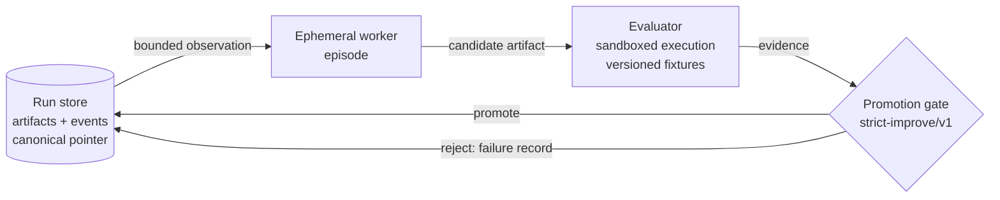

# stigmergic-dev-runtime

[](https://github.com/rayvoidx/stigmergic-dev-runtime/actions/workflows/ci.yml)
[](LICENSE)
[](pyproject.toml)

A minimal, reproducible research runtime for **evaluator-gated stigmergic software
evolution**.

**Thesis.** *Persistent projects, ephemeral agents:* finite-lived AI workers can
accumulate useful software capability through versioned executable artifacts,
lineage, evidence, and failure records — without depending on persistent
conversational identity.

Workers never talk to each other. Coordination happens only through the shared
project state: the canonical artifact, its lineage, evaluator evidence, and the
recorded failures of earlier (now gone) workers.

## Research questions

- **RQ1** Under matched inference and tool budgets, does artifact-mediated
  coordination outperform a single persistent agent and isolated best-of-N on
  continuous software-evolution milestones?
- **RQ2** How much useful coordination remains when direct agent communication
  is removed but executable artifacts, lineage, evaluator evidence, and failure
  records persist?
- **RQ3** Does inherited failure evidence reduce repeated failures and
  regressions without suppressing exploration?
- **RQ4** Does artifact-centric state improve continuity when workers or model
  providers are replaced?

See `docs/research_protocol.md` for hypotheses, variables, metrics, and the
statistical plan; `docs/related_work.md` for the claim ledger.

## Quickstart

```bash
python3 -m venv .venv && .venv/bin/pip install -e '.[dev]'
.venv/bin/stigdev demo                      # deterministic offline demo -> runs/demo-seed42
.venv/bin/stigdev lineage runs/demo-seed42  # promotion chain + failure records
.venv/bin/stigdev replay runs/demo-seed42   # re-derive all evidence, verify the run
.venv/bin/python -m pytest                  # full suite
```

Requires Python >= 3.12. No third-party runtime dependencies; `pytest` for dev.
The demo, benchmark, and tests are fully offline and deterministic — no model
API calls, no network, no cost.

## What one run does

Each episode is an ephemeral worker: it sees only a bounded observation
(canonical artifact + score, recent failure records, budget), proposes a full
replacement artifact, and disappears. The evaluator executes the candidate in a
sandbox against versioned fixtures; the promotion gate accepts strict
improvements only. Rejected candidates stay content-addressed on disk as
failure evidence — visible to later workers, never contaminating canonical
state.



Every transition is an event in an append-only `events.jsonl`; artifacts are
immutable `artifacts/<sha256>.py` files; `manifest.json` pins config, seeds,
fixture hashes, evaluator/policy versions, environment, and cost. `stigdev
replay` re-executes every recorded evaluation and verifies the promotion chain;
`stigdev recover` restores the canonical pointer from the event log after
corruption.

## TrendEvoBench

A toy, fully synthetic trend-selection benchmark (`benchmarks/trendevobench/`):
evolve `select_trends(items, k) -> ids` against fixtures containing clickbait
traps, near-duplicates, stale items, and keyword-bearing hype. Metrics:
precision@k, duplicate-group uniqueness, composite score, train/holdout split.
The seed-42 demo goes from 0.55 to 0.86 (train) and 0.52 to 0.86 (holdout) via
three promotions, with five rejections recorded as failure evidence.

The shipped offline provider is a deterministic reference worker that proposes
predefined mutations ("genes") — it exists to exercise the runtime and tests
without a model API. It reads inherited failure records and skips known-failed
mutations (the RQ3 mechanism, toggleable via `use_failure_memory`). Live
provider adapters (Anthropic/OpenAI) are future work behind the same
`Provider` protocol.

## Experimental conditions

`configs/conditions/` holds matched-budget configs for all five comparison
arms. Only `artifact_only` is implemented; the others parse, validate, and
**refuse to run** rather than silently falling back:

| Condition | Status |
|---|---|
| `single_persistent` | config only |
| `best_of_n` | config only |
| `artifact_only` (stigmergic) | **implemented** |
| `full_communication` | config only |
| `orchestrator` | config only |

## Current limitations

- The sandbox (`stigdev/sandbox.py`) is process isolation only: separate
  CPython in `-I` mode, timeout, temp cwd. It does **not** confine filesystem
  or network access and is not a security boundary against malicious code.
- The offline provider explores a small fixed mutation space; results with it
  demonstrate the runtime mechanics, not model capability.
- TrendEvoBench is a toy task; no experimental results exist yet. Nothing here
  claims autonomous continual learning or superiority over other approaches.
- Four of five experimental conditions are configuration-only.

## Public/private boundary

This repository is public (Apache-2.0) and self-contained: generic runtime,
schemas, synthetic fixtures, benchmark, docs. It must never contain production
connectors, scraped data, credentials, commercial ranking logic, or private
prompts. Downstream commercial systems (e.g. a trend agent) may depend on this
runtime through the interfaces described in `docs/integration_boundary.md`;
the dependency is strictly one-way. See `SECURITY.md`.

## Repository map

```
stigdev/                  runtime package (store, sandbox, evaluator, policy,
                          provider, worker, runtime, replay, cli)
benchmarks/trendevobench/ fixture generator, versioned fixtures, seed artifact
configs/conditions/       five matched-budget experiment configs
examples/sample_run/      committed output of the deterministic demo
tests/                    unit + end-to-end suite (pytest)
docs/                     ADRs, related-work claim ledger, research protocol,
                          paper outline, integration boundary
PROJECT_STATE.md          durable state + decision log for continuation
```

## License

Apache-2.0. See `LICENSE`, `CITATION.cff`, `CONTRIBUTING.md`, `ROADMAP.md`.
