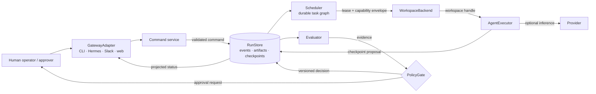
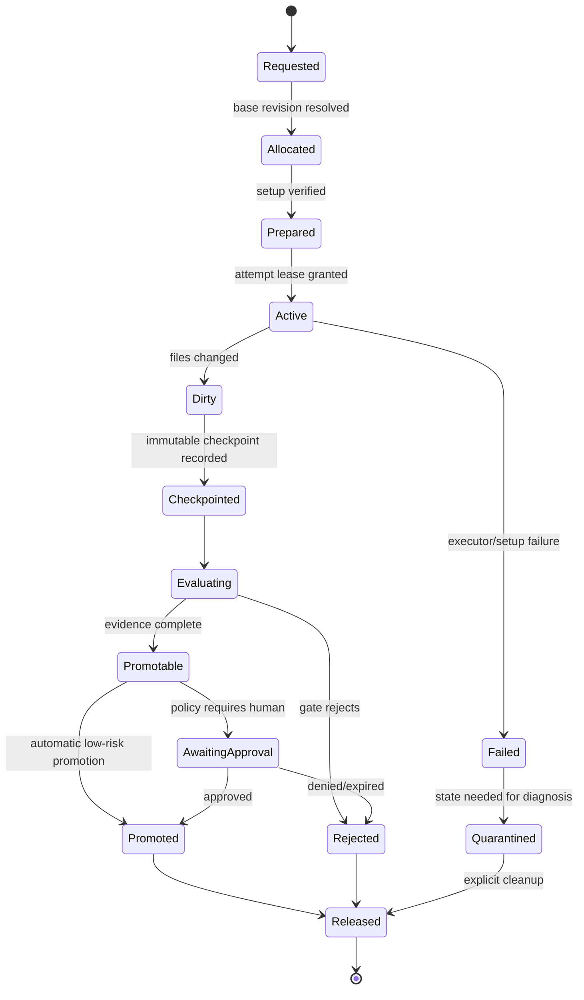

# Agentic Engineering OS architecture

Status: design v1 merged in PR #1 (`5867f67`); offline contracts implemented
and verified offline on 2026-09-14 (ADR 0005).
Operational components remain future design. No OS integration described here is
implemented unless it is explicitly listed under “Current runtime.”

## Purpose

The Agentic Engineering OS is a human-governed system for executing bounded
engineering tasks with replaceable coding agents while durable project state,
evidence, policy, and recovery live outside agent conversations.

This document extends the runtime thesis without replacing it:

> Persistent projects, ephemeral agents.

The research kernel tests whether coordination can persist through artifacts
and evidence. The proposed OS applies the same separation to repositories,
task graphs, workspaces, approvals, and external control-plane gateways.

## Goals

- Preserve the public runtime and its experiment lineage.
- Execute each task in an explicitly allocated workspace with a bounded
  permission and budget envelope.
- Make agent implementations replaceable without making conversational state
  canonical.
- Record every material state transition as a durable, replayable event.
- Evaluate changes before promotion and require human approval for configured
  risk classes.
- Recover after agent, provider, scheduler, gateway, or workspace failure.
- Support multiple repositories eventually without weakening the public/private
  dependency boundary.

## Non-goals

- Renaming `stigdev` or this repository.
- Claiming that the current research results validate an operational OS.
- Directly integrating Hermes, Slack, Orca, Codex, Claude Code, or OpenCode in
  this design change.
- Autonomous merge, deployment, credential use, or paid inference by default.
- Treating Git worktrees or the current subprocess sandbox as security
  boundaries.
- Storing an agent transcript or vendor session as canonical project state.
- Moving private service code or data into this repository.

## Scope boundary

| Scope | Purpose | Status in this repository |
|---|---|---|
| Research paper | Evaluate artifact-mediated coordination under controlled conditions. | Active; three of five conditions implemented, H5 partially confirmatory. |
| Research kernel | Artifact store, evaluator, gate, replay/recovery, providers, benchmark, matrix runner. | Implemented with documented limits. |
| Agentic Engineering OS contracts | Agent execution, workspaces, scheduler, generalized events/checkpoints, approvals, gateways. | Execution/workspace protocols, fakes, and evidence implemented; remaining components deferred. |
| Operational control plane | Multi-repo deployment, gateway services, secrets, schedulers, repository management. | Not present; possible future repository. |
| Private application | Domain data, prompts, connectors, ranking, production validation. | Separate private repository. |

## Current runtime

The current implementation is a single-process, single-canonical-artifact
research runtime.

| Component | Present behavior | Current limit |
|---|---|---|
| `RunConfig` / `Budget` | Pins condition, provider, fixtures, policy, episode/call/token/USD/wall fields. | No concurrency budget; `max_usd` is not enforced; token enforcement is post-response. |
| `Provider` | Offline deterministic proposal worker and local HTTP Ollama adapter. | Text generation only; no paid providers. |
| Worker episode | Builds a bounded observation, requests a complete Python module, evaluates and gates it. | One opaque module, sequential episodes. |
| `RunStore` | Content-addressed artifacts, flat JSONL events, manifest, canonical pointer. | File writes are not transactional; events lack an embedded schema version. |
| Evaluator | TrendEvoBench train/holdout evaluation via `Sandbox`. | One task family and evaluator version. |
| Policy | Strict train-score improvement after hard checks. | No human approval or multi-policy composition. |
| Replay/recovery | Re-executes evaluations, compares pass/score, checks lineage/canonical pointer; reconstructs the pointer. | Does not compare full evidence or re-run policy decisions. |
| Conditions | `artifact_only`, `single_persistent`, `best_of_n`. | `full_communication` and `orchestrator` fail closed. |
| Matrix runner | Conditions × seeds with descriptive bootstrap CIs. | Sequential; research statistics beyond aggregation remain external. |
| Sandbox | Isolated CPython process, timeout, temporary cwd. | Does not confine filesystem or network. |
| Execution contracts | `AgentExecutor`, `WorkspaceBackend`, deterministic fakes, `execute_agent`, inspection/recovery. | Single writer; no real backend, supervision, capability/budget enforcement, or canonical promotion. |

## Proposed component model



No adapter has authority to bypass the event store, and no candidate promotion
may skip its configured evaluator or policy gate. The diagram is logical:
deployment boundaries are deliberately undecided.

## Core contracts

The broader OS examples below are future interface sketches. The exact
implemented APIs and an offline example are in `docs/execution_contracts.md`.

The current implementation combines the `AgentExecutor` and `WorkspaceBackend`
contracts in one reviewed change. It uses synchronous typed requests/results,
deterministic in-process test doubles, and a separate execution entry point
that accepts an existing `RunStore`. Request instructions and environment
values are transient. Durable records contain allowlisted metadata, lineage,
safe outcome classifications, and artifact/revision references only.

This entry point records requested, prepared, started, and terminal execution
events using the existing flat envelope plus `execution_version: 1`.
It does not call `runtime.run`, select a task, evaluate a candidate, or promote
canonical state. Reopened stores can inspect attempts and terminalize an
interrupted attempt as an unknown outcome; retry requires a new attempt ID.
Only complete JSONL records are supported by current recovery; torn writes,
concurrent writers, and transactional promotion belong to integrity v2.
The operator must stop the prior writer before recovery; no leases, fsync, or
exactly-once execution are provided. Instructions, environments, locators,
exception text, and raw output are omitted from durable records. Callers still
must review public metadata and artifacts for secrets.

Cancellation has a typed terminal outcome in this phase. Asynchronous cancel,
heartbeat, process-tree termination, production workspace allocation/cleanup,
general checkpoint blobs, and budget reservation are deliberately deferred.
The synchronous executor must honor its timeout; the runner can reject a late
result but cannot forcibly stop an arbitrary Python implementation. No real
agent or untrusted code may rely on this contract-only phase for containment.

### Provider

`Provider` is model-level inference:

```text
generate(ProviderRequest) -> ProviderResponse
```

The request pins model parameters and a budget identity. The response contains
model output, usage, cost, and provider provenance. A provider does not own a
Git worktree, shell process, task retry, checkpoint, or promotion decision.

### AgentExecutor

The implemented protocol is
`AgentExecutor.execute(ExecutionRequest) -> ExecutionResult`, with an
`executor_id`. It handles one assigned attempt; the separate `execute_agent`
function validates its outcome and records evidence. Process supervision is
not supplied by the protocol or deterministic fake.

The future supervision sketch is:

```text
execute(TaskSpec, WorkspaceHandle, CapabilityEnvelope, AttemptBudget)
    -> AttemptResult + EventStream
cancel(AttemptId) -> CancellationResult
```

Future adapters would own process lifecycle, stdout/stderr capture, heartbeats, cancellation,
tool-side-effect reporting, and agent-session provenance. It may wrap Codex,
Claude Code, OpenCode, or a deterministic fake. It may use one or more
providers internally, but the OS treats that as executor behavior unless the
usage is emitted in normalized events.

`AttemptResult` references a workspace checkpoint and structured outcome; it
does not directly change canonical state.

### Provider versus AgentExecutor

| Concern | `Provider` | `AgentExecutor` |
|---|---|---|
| Unit | One inference request/response | One supervised engineering attempt |
| Side effects | None outside provider service | May edit files and invoke allowed tools |
| Workspace | None | Required handle |
| Lifecycle | Request timeout | Launch, heartbeat, cancel, exit, recovery |
| Credentials | Model endpoint only | Capability-scoped tool/repository credentials |
| Output | Text/tool response plus usage | Checkpoint, diff, logs, outcome, usage |
| Retry owner | Caller | Scheduler, using executor failure classification |

### WorkspaceBackend

The implemented `WorkspaceBackend` exposes `backend_id`, `create`, `resolve`,
`prepare`, `inspect`, `retain`, and `dispose` using `WorkspaceSpec`,
`WorkspaceRef`, and `WorkspaceState`. Only the fake backend exists; the caller
owns retention/disposal, including after failure. Checkpoint storage remains
deferred. The future allocation/checkpoint sketch is:

```text
allocate(RepositoryRef, BaseRevision, WorkspacePolicy) -> WorkspaceHandle
prepare(WorkspaceHandle, SetupPlan) -> PreparedWorkspace
checkpoint(WorkspaceHandle, AttemptId) -> CheckpointRef
inspect(WorkspaceHandle) -> WorkspaceState
release(WorkspaceHandle, ReleasePolicy) -> ReleaseResult
```

Backends may use local Git worktrees, containers, remote workspaces, or test
fakes. A local worktree backend gives file/branch isolation for concurrent
work; it does not protect the host from malicious code.

### Scheduler

`Scheduler` owns task readiness, durable leases, concurrency, retry, and
budget reservation. It does not evaluate code or decide promotion.

```text
submit(TaskGraph) -> RunId
lease_ready(WorkerIdentity, Capacity) -> AttemptLease | None
heartbeat(LeaseId)
complete(LeaseId, AttemptResult)
cancel(RunId | TaskId)
```

### Evaluator and PolicyGate

`Evaluator` maps a checkpoint plus pinned evaluation inputs to immutable
evidence. `PolicyGate` maps evidence, current canonical state, actor
permissions, and policy version to one of:

- `promote`;
- `reject`;
- `request_human_approval`;
- `quarantine`.

Evaluation failure is not candidate failure. An unavailable or invalid
evaluator produces an infrastructure failure and must not promote or consume a
candidate-quality conclusion.

### RunStore

`RunStore` is the only durable source for run/task/attempt state. Derived
indexes, dashboards, canonical pointers, and scheduler queues must be
rebuildable from events plus referenced immutable blobs/checkpoints.

The first implementation may remain file-backed, but its contract must permit
a transactional backend later without changing domain event meaning.

### GatewayAdapter

`GatewayAdapter` authenticates an external principal, translates input to a
versioned command, attaches an idempotency key, and projects authorized status
back to the source. It never receives direct write access to a workspace or
canonical pointer.

## Workspace and Git worktree lifecycle



Rules:

1. Resolve the repository and exact base commit before allocation; record both
   symbolic ref and commit SHA.
2. Give one active writer lease to a workspace. Parallel tasks use distinct
   workspaces even if they share a base revision.
3. Treat dependency setup as a versioned `SetupPlan`; record its result and
   hashes without storing secrets.
4. Checkpoint changed files before evaluation. For Git, record commit/tree
   identity and a patch digest; never make an agent transcript the checkpoint.
5. Promote with compare-and-swap against the expected canonical revision. A
   stale candidate returns to rebase/re-evaluate or is rejected by policy.
6. Preserve failed workspaces only under a bounded quarantine policy; cleanup
   is explicit and auditable.
7. A worktree path is metadata, not stable identity and not a security
   boundary.

Orca currently remains outside this lifecycle as the developer environment
that creates a human-selected worktree and launches an agent with that
worktree as its current directory. A future Orca adapter must use the same
workspace events and may not become an alternate source of canonical state.

## Scheduler and task graph

A `TaskGraph` is a DAG of immutable task specifications. A task becomes
`ready` only when its dependencies satisfy their declared completion policy.
Each execution creates a new attempt; retry never rewrites a prior attempt.

Required task fields:

- stable `task_id`, run ID, repository ref, and base revision;
- objective and acceptance-evaluator references;
- dependency IDs and output/checkpoint inputs;
- executor selector and capability envelope;
- retry class and maximum attempts;
- budget and concurrency class;
- policy profile and required approval class.

Task state is derived from events:

```text
pending -> ready -> leased -> running -> checkpointed -> evaluating
        -> awaiting_approval -> succeeded
        -> retry_wait -> ready
        -> failed | cancelled | budget_exhausted | quarantined
```

Only the scheduler creates leases. Leases expire unless heartbeated, and lease
completion is idempotent. A scheduler restart replays events, expires stale
leases, reconciles budget reservations, and resumes ready tasks.

The experimental `orchestrator` condition is not this operational scheduler.
The former is a controlled research arm whose delegation is an independent
variable; the latter is neutral execution infrastructure shared by arms.

## Checkpoints, canonical state, and recovery

The current canonical object is one content-addressed Python module. The OS
generalizes it to a `CheckpointRef` while keeping immutable content identity:

```text
CheckpointRef = {
  repository_id,
  base_revision,
  tree_digest,
  patch_digest,
  artifact_refs[],
  parent_checkpoint_ids[],
  producer_attempt_id,
  created_event_id
}
```

Recovery invariants:

- every canonical transition cites its previous canonical checkpoint,
  evidence IDs, policy decision ID, and actor/approval if required;
- a pointer is only a cache and can be reconstructed from accepted events;
- incomplete checkpoints are unreachable from canonical state;
- replay verifies blob hashes, evidence, gate decisions, transition order, and
  the final materialized pointer;
- v1 committed run directories remain readable or receive a documented,
  non-destructive migration path.

## Hermes, Slack, Orca, and CLI boundaries

| Surface | Proposed role | Explicitly not allowed |
|---|---|---|
| Hermes | Optional authenticated command/status gateway in an operational deployment. | Direct scheduler database, workspace, secret, or canonical-state writes. |
| Slack | Human request, notification, and approval surface through signed/idempotent commands. | Treating a message or reaction alone as durable execution truth. |
| Orca | Developer worktree/agent-session environment; possible future adapter or workspace backend. | Becoming a required public-runtime dependency or a security boundary. |
| Local CLI | Reference gateway for offline development and deterministic tests. | Bypassing policy merely because it is local. |

Product-specific claims are intentionally minimal. Adapter behavior must be
verified against the relevant product at implementation time. The current
design adds no SDK, token, webhook, MCP server, or external call.

## Public/private repository boundary

```text
public stigmergic-dev-runtime
  owns: domain contracts, event semantics, deterministic fakes,
        synthetic benchmarks, research conditions, replay logic

future control plane (only when extraction criteria are met)
  owns: deployed scheduler/API, gateway services, repository manager,
        operational dependencies and secrets interfaces

private social-trend-agent
  owns: production data/connectors, private prompts, ranking logic,
        credentials, service-specific policy and integration tests
```

Dependencies point from the lower/application layers toward published public
contracts, never from the public runtime toward private code.

## Security and permission model

### Principals and roles

- `observer`: read authorized status and evidence;
- `operator`: submit/cancel bounded tasks and inspect owned workspaces;
- `approver`: approve a named policy decision within scope;
- `administrator`: configure repositories, executors, policies, and gateway
  trust; administration does not imply automatic code approval;
- `executor`: machine identity holding one attempt lease and capability set.

### Capability envelope

Every attempt receives an allowlist covering:

- repository and base revision;
- readable/writable paths;
- allowed tools and commands;
- network destinations (denied by default);
- credential handles (never raw secrets in prompts/events);
- maximum process duration and child-process count;
- permitted checkpoint and publication operations.

Scheduler or agent output cannot widen this envelope. Gateways can request
capabilities but only policy/administration can grant them.

### Default approval gates

Human approval is required before production deployment, merge to a protected
branch, access to production credentials or customer data, paid API use above
an approved reservation, permission expansion, destructive cleanup of
material state, or cross-repository publication. Policies may auto-promote
only low-risk changes whose evaluator and permission profile explicitly allow
it.

Secrets are referenced by opaque IDs, injected at execution time, redacted
from logs, and excluded from artifacts/checkpoints. Worktree isolation alone
does not satisfy this model; untrusted execution requires a stronger sandbox
backend.

## Observability event schema

Current v1 records are flat objects shaped as `{seq, type, ts, ...payload}`.
The proposed OS envelope is versioned and separates metadata from payload:

```json
{
  "schema_version": 2,
  "event_id": "evt_...",
  "run_id": "run_...",
  "task_id": "task_...",
  "attempt_id": "attempt_...",
  "sequence": 42,
  "occurred_at": "2026-09-09T12:00:00Z",
  "type": "workspace.checkpointed",
  "actor": {"kind": "executor", "id": "codex-local-1"},
  "correlation_id": "cmd_...",
  "causation_id": "evt_...",
  "idempotency_key": "gateway-message-id",
  "payload": {},
  "provenance": {"component": "workspace-backend", "version": "..."}
}
```

Required event families:

- `command.received`, `command.rejected`;
- `run.created`, `run.started`, `run.finished`, `run.cancelled`;
- `task.ready`, `task.leased`, `task.retry_scheduled`, `task.finished`;
- `attempt.started`, `attempt.heartbeat`, `attempt.completed`,
  `attempt.failed`, `attempt.cancelled`;
- `workspace.allocated`, `workspace.prepared`, `workspace.checkpointed`,
  `workspace.released`, `workspace.quarantined`;
- `provider.called`, `provider.usage_recorded`, `budget.reserved`,
  `budget.reconciled`, `budget.exhausted`;
- `evaluation.started`, `evaluation.recorded`, `evaluation.failed`;
- `policy.decided`, `approval.requested`, `approval.recorded`;
- `canonical.promoted`, `canonical.recovery_started`,
  `canonical.recovered`;
- `security.permission_denied`, `security.secret_redacted`.

Events contain stable IDs and hashes, never full secrets. Large logs,
transcripts, diffs, and evidence bodies are immutable blobs referenced by
digest. Heartbeats may be compacted in projections but not silently removed
from the source-of-truth retention policy.

## Budget and concurrency control

Budgets are hierarchical: organization/deployment (outside the public kernel),
run, task, and attempt. Dimensions include provider calls, input/output tokens,
USD, wall time, executor time, workspace count, and concurrent attempts.

The scheduler uses reservation and reconciliation:

1. atomically reserve worst-case attempt capacity before leasing;
2. reject or queue work when any ancestor budget lacks capacity;
3. record normalized provider/executor usage;
4. reconcile actual usage and release unused reservation;
5. stop new work at exhaustion and request cancellation of active work;
6. record overshoot separately rather than hiding it.

Concurrency rules:

- one writer lease per workspace;
- configurable run/global executor semaphores;
- provider-specific rate/concurrency buckets;
- evaluation concurrency isolated from agent concurrency;
- optimistic compare-and-swap for canonical promotion;
- deterministic scheduler tie-breaking where research comparability requires
  it.

## Failure modes

| Failure | Detection | Required response |
|---|---|---|
| Agent exits, hangs, or loses heartbeat | Process status, deadline, lease expiry | Cancel, checkpoint/quarantine, classify retry, append failure event. |
| Provider error or malformed response | Adapter validation and usage reconciliation | No promotion; retry only under pinned policy and remaining budget. |
| Evaluator unavailable or invalid | Evaluator health/result schema | Infrastructure failure, not candidate rejection; fail closed. |
| Budget exhaustion/overshoot | Atomic ledger plus actual-usage events | Stop leases, cancel when safe, record dimension and overshoot. |
| Workspace setup or cleanup failure | Backend state inspection | Quarantine if state matters; never silently reuse dirty state. |
| Concurrent/stale promotion | Canonical compare-and-swap fails | Rebase and re-evaluate or reject; never overwrite newer state. |
| Event append succeeds but projection write fails | Projection/version mismatch on recovery | Rebuild projections from events. |
| Partial event/blob write | Missing digest or checksum mismatch | Keep unreachable, report integrity failure, never promote. |
| Scheduler restart | Startup replay and lease scan | Reconstruct queues, expire stale leases, reconcile reservations. |
| Duplicate gateway delivery | Idempotency key | Return prior command result without a second task. |
| Permission or secret boundary violation | Capability broker/redaction checks | Deny, emit security event, revoke attempt if necessary. |
| Merge conflict or base ref moved | Git identity and CAS check | Produce a new task/attempt; preserve both histories. |

## Phased delivery

1. **Research/document baseline:** reconcile claims and approve boundaries.
2. **Research condition completion:** implement `orchestrator` and
   `full_communication` as experimental arms without using the operational
   scheduler/gateway as hidden treatment.
3. **Execution contracts:** typed `AgentExecutor` and `WorkspaceBackend` plus
   deterministic test doubles and recorded execution evidence. No real CLI or
   production workspace manager. The research lane is not a prerequisite.
4. **Durable control core:** versioned events, task DAG, leases, checkpoints,
   full replay, budget ledger, and policy approvals.
5. **Gateway projections:** local CLI first, then separately approved
   Hermes/Slack/Orca adapters.
6. **Private testbed and extraction review:** validate from the private
   consumer and decide whether control-plane deployment warrants a new repo.

Detailed sequencing and verification gates are in
`docs/implementation_plan.md`.

After the contracts, the preferred integration order is GitWorktreeBackend,
OpenCode adapter, Codex CLI adapter, then Hermes gateway. Real executor use is
gated on suitable isolation and accounting; Hermes also requires the durable
control core and gateway API. This order is not authorization to start them.

## Architecture acceptance criteria

The design is ready for implementation only when reviewers confirm that:

- current and proposed components are unmistakably labeled;
- `Provider` and `AgentExecutor` cannot substitute for each other silently;
- workspace, task, attempt, evaluation, approval, and promotion state
  transitions are defined;
- every failure mode ends fail-closed with a recovery path;
- budget reservations prevent unbounded parallel overspend;
- canonical state is reconstructable without an agent transcript or gateway;
- external gateways cannot bypass authentication, idempotency, evaluation, or
  policy;
- Git worktree isolation is not presented as sandboxing;
- committed v1 runs retain a replay/migration path;
- the public/private boundary satisfies ADR 0003;
- no paid call, live integration, or production mutation is required by public
  tests.
