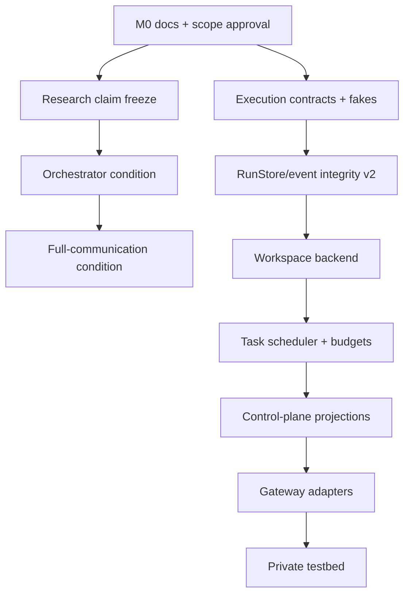

# Agentic Engineering OS implementation plan

Status: M0 merged in PR #1 (`5867f67`); M4 offline contracts, M6 (ADR 0006)
and M5 GitWorktreeBackend (2026-09-20) are implemented and verified offline.
M7 and later integrations are not authorized by this baseline. Milestone numbers identify workstreams, not a single serial queue.

## Delivery principles

- Keep research-condition implementations separate from neutral operational
  infrastructure so treatment variables remain observable.
- Use one worktree and one reviewable change set per independent contract.
- Preserve current run directories and published experiment data; never
  rewrite evidence in place.
- Add deterministic fakes before a live CLI agent or gateway.
- Introduce no paid API, production secret, or private repository dependency in
  public CI.
- Define event, failure, and acceptance behavior before implementation.

## Dependency map

The research and control-core lanes may proceed independently only after their
shared terminology and event-treatment boundary are approved.

## Milestones and verification gates

### M0 — Design and state reconciliation

Worktree: `docs/os-design-v1` (merged in PR #1, `5867f67`).

Deliverables:

- repository state audit;
- ADR 0005;
- OS architecture and implementation plan;
- root `AGENTS.md`;
- synchronized README, project state, roadmap, protocol, paper outline, and
  affected boundary/security documents.

Gate:

- no runtime behavior changes;
- full existing test suite passes offline;
- committed example runs replay successfully;
- reviewers explicitly accept or amend ADR 0005.

### M1 — Research claim freeze

Worktree: `docs/paper-state-sync`.

Purpose: perform a second-person audit of the reconciled claim ledger and turn
the paper outline into a versioned evidence table. This is not a place to add
new results.

Acceptance:

- every numeric result links to committed data;
- mechanism, exploratory, and partially confirmatory evidence are separated;
- H1–H4 remain unconfirmed; H5 caveats match the lab note and registration
  history;
- paper scope excludes operational OS claims.

### M2 — Experimental orchestrator condition

Worktree: `feat/orchestrator-condition`.

Purpose: implement condition 5 as a controlled research arm. This is an
experimental central planner, not the operational task scheduler.

Required design before code:

- planner observation and delegation schema;
- exact matched-budget accounting for planner and workers;
- logged delegation events and prompt hashes;
- fail-closed behavior for invalid or missing delegation;
- deterministic offline reference planner.

Acceptance:

- config no longer raises `ConditionNotImplementedError` only for this arm;
- calls/tokens/wall allocation remains comparable to the other conditions;
- every delegation is replay-addressable and no unlogged fallback exists;
- offline tests use no network and existing condition outcomes do not change;
- protocol and project state are updated.

### M3 — Full-communication condition

Worktree: `feat/full-communication`.

Purpose: implement condition 4 with a logged inter-worker message channel.
This channel is a research treatment, not Slack or Hermes.

Required design before code:

- message visibility, ordering, retention, and size/token accounting;
- worker identity semantics that do not become canonical project identity;
- matched budgets including message-generation cost;
- deterministic offline sender/receiver behavior.

Acceptance:

- all messages are immutable events or referenced blobs;
- turning the channel off reproduces the existing artifact-only observation;
- replay detects message-order/content tampering relevant to evaluation;
- H2 can be executed without changing other arm semantics.

### M4 — AgentExecutor and WorkspaceBackend contracts

Worktree: `feat/agent-executor-contract`.

Worktree display name: `agent-executor-contract`; branch:
`feat/agent-executor-contract`; base: latest `main` containing M0.

Purpose: add both generic contracts, typed lifecycle data, minimal execution
evidence, and deterministic test doubles before any vendor CLI or Git backend.

Implementation: `stigdev/executor.py`, `workspace.py`, `execution.py`, and
`testing.py`; CLI inspection via `executions` and `recover-executions`.
Verification: 135 offline tests and all 10 example replays pass.
See `docs/execution_contracts.md` for exact interfaces
and limitations. The narrow capability input is an assigned workspace ref,
explicit environment, timeout, and budget metadata; full capability enforcement
is deferred.

Acceptance:

- requests identify run/task/attempt/executor/workspace, transient instructions
  and safe environment, timeout, budget metadata, and optional parent attempt;
- results carry status, timestamps, exit code, omitted-output markers,
  artifact references, before/after revisions, classified failure,
  retryability, and optional usage;
- workspace create/resolve, prepare, inspect, and retain/dispose form a typed
  lifecycle that does not depend on a local path or choose tasks;
- `Provider` remains source-compatible and is not used as the executor base;
- assigned workspace, explicit environment, timeout, and attempt-budget
  metadata are required inputs; these do not enforce tool/network permissions;
- a fake executor proves success, malformed output, crash, timeout, and cancel
  paths offline;
- no Codex/Claude/OpenCode dependency or live invocation is added;
- a separate synchronous execution function accepts the existing `RunStore`,
  writes additive versioned execution events, and never promotes candidates;
- tests cover workspace preparation failure, event order, lineage, interrupted
  recovery, secret/environment exclusion, and existing Provider compatibility;
- durable events never copy raw instructions, environments, locators, logs,
  or exception text;
- replay inspects stored evidence without executing an agent again; the v1
  evaluator replay and canonical recovery behavior remain unchanged.

Heartbeat transport, asynchronous cancellation, process termination, real
worktree management, scheduler leases, paid-budget reservation, and general
checkpoint storage remain interface-only or deferred. The runner cannot
enforce a deadline against arbitrary in-process code; real adapters must add
supervision before live use. Recovery requires the previous writer to have
stopped and only appends an interrupted outcome; it does not resume attempts,
repair torn JSON, supply locks/leases, or guarantee exactly-once execution.

### M5 — GitWorktreeBackend

Worktree: `feat/workspace-backend`.

Purpose: implement the M4 workspace contract using local Git. Allocate a
worktree at an exact base SHA, prepare it, checkpoint
changes, inspect state, quarantine failures, and release safely.
Checkpoints use the content-addressed tree shape fixed in ADR 0006, so M5
follows M6.

Status (2026-09-20): implemented in `feat/workspace-backend`
(`stigdev/gitworkspace.py`, `docs/git_worktree_backend.md`); 188 tests pass.

Acceptance:

- concurrent test workspaces never share writable paths;
- one-writer lease is enforced;
- base commit, branch, tree/patch digest, and cleanup outcome are recorded;
- dirty/untracked state is never silently discarded;
- path traversal and symlink escape tests fail closed;
- documentation states that worktrees are not a security boundary.

### M6 — RunStore and integrity v2

Suggested worktree: `fix/run-integrity-v2`.

Design: ADR 0006 (accepted 2026-09-20) fixes the transaction model (stdlib
SQLite WAL, one writer per store), envelope v2, idempotent append and pointer
compare-and-swap, event-sourced leases with restart recovery, the
content-addressed tree checkpoint shape, v1 read-only compatibility, and
store-boundary redaction. Because the checkpoint shape is fixed here, M6
precedes M5.

Status (2026-09-20): implemented. Kernel scope in `fix/run-integrity-v2`
(`stigdev/eventstore.py`, `ledger.py`, `v1import.py`, atomic v1 pointer) and
replay v2 in `fix/replay-v2` (complete evidence comparison, policy re-run,
strict event-log parsing, `replay_store`, corruption matrix). 178 tests pass;
all 10 committed example runs replay clean. Benchmark runs still write the v1
file store. See `docs/event_store_v2.md`.

Purpose: introduce a versioned event envelope, immutable checkpoint references,
idempotent append semantics, and complete replay while preserving v1 readers.

Acceptance:

- every new event carries schema/run/event identity and causation metadata;
- v1 committed examples still replay or a non-destructive converter is tested;
- replay compares complete evaluator evidence and re-runs policy decisions;
- canonical promotion uses compare-and-swap and recovery covers interrupted
  event/projection writes;
- corruption tests cover events, metrics, reasons, policy decisions, blobs,
  and pointers.

### M7 — Durable scheduler, task graph, and budget ledger

Suggested worktree: `feat/task-scheduler`.

Purpose: schedule DAG tasks with durable leases, retries, hierarchical budget
reservations, and concurrency limits.

Acceptance:

- readiness follows dependency policy and deterministic tie-breaking;
- duplicate completions and expired leases are idempotent;
- scheduler restart reconstructs queues and reservations from the store;
- calls, tokens, USD, wall time, workspaces, and concurrency are reserved and
  reconciled;
- `max_usd` is enforced before any paid provider adapter is eligible;
- cancellation and exhaustion stop new leases and produce terminal events.

### M8 — Control-plane event/status API

Worktree: `feat/control-plane-events`.

Purpose: expose authenticated command ingestion and read-only projections for
gateways without exposing store or workspace internals.

Acceptance:

- command IDs/idempotency prevent duplicate runs;
- authorization is evaluated before command append;
- status is reconstructable from events;
- approval requests and decisions cite policy/evidence versions;
- synthetic CLI tests cover submit, inspect, approve, deny, cancel, resume;
- no Slack, Hermes, or Orca SDK is required.

### M9 — External adapters

Separate worktrees after M8, one product at a time. Implementation-time
documentation verification is mandatory because product contracts can change.

- `integration/orca-adapter`: bridge approved workspace/session operations;
- `integration/slack-gateway`: signed commands, notifications, approvals;
- `integration/hermes-gateway`: authenticated command/status translation.

Acceptance shared by all adapters:

- deterministic contract tests with fakes;
- credential redaction and least privilege;
- idempotent duplicate delivery;
- no direct canonical/workspace mutation;
- explicit user approval before live external tests.

### M10 — Private application testbed and repository extraction review

Worktree/repository: `integration/social-trend-testbed` in the private
`social-trend-agent` repository.

Purpose: consume the public contracts from the private side and validate a
real application without upstreaming private assets.

Acceptance:

- dependency remains private → public;
- no private data, prompt, credential, connector, or ranking logic appears in
  the public repository or its run artifacts;
- public CI remains self-contained;
- ADR 0005 extraction criteria are reviewed with deployment evidence.

## Recommended worktree order after design approval

| Order | Worktree | Output | Can run in parallel? |
|---:|---|---|---|
| 1 | `docs/paper-state-sync` | Independent research-claim review | Yes, after M0 |
| 2 | `feat/orchestrator-condition` | Experimental condition 5 | No with condition 4 until shared message/delegation schema is agreed |
| 3 | `feat/full-communication` | Experimental condition 4 | After M2 interface review |
| 4 | `feat/agent-executor-contract` | Executor/workspace types, fakes, execution evidence | Implemented and verified offline |
| 5 | `fix/run-integrity-v2`, `fix/replay-v2` | Versioned events/checkpoints/full replay | Implemented and verified offline |
| 6 | `feat/workspace-backend` | GitWorktreeBackend | Implemented and verified offline |
| 7 | `feat/task-scheduler` | DAG, leases, retry, budgets/concurrency | After event integrity |
| 8 | `feat/control-plane-events` | Command and projection API | After scheduler domain events |
| 9 | product-specific integration worktrees | Orca/Slack/Hermes adapters | After control-plane API, one at a time |
| 10 | private `integration/social-trend-testbed` | Real-service validation | After stable public contracts |

Do not start all worktrees at once. Parallelism is safe only across the
research lane and execution-contract lane after ADR approval; each dependency
edge is a verification pause.

The integration preference after M6 is GitWorktreeBackend → OpenCode adapter
→ Codex CLI adapter → Hermes gateway. Each is a separate future task. Real
execution needs suitable isolation and accounting first; Hermes still depends
on M6–M8. Research M1–M3 can proceed independently and do not block M4.

## Decisions to resolve before later milestones

1. Amend ADR 0005 explicitly if later milestones change its accepted boundary.
2. Choose the first event-store transaction model and v1 compatibility policy
   — proposed in ADR 0006.
3. Choose the minimum isolation level for the first real CLI executor.
4. Define the default human-approval matrix.
5. Decide whether research-condition completion precedes OS contract work or
   proceeds as a parallel lane.
6. Define the minimal effect/replication threshold for the next H5 study; this
   is a research decision, not an implementation default.
