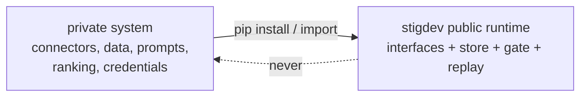

# Integration boundary for private consumers

How a private commercial system (e.g. `social-trend-agent`) consumes this
public runtime without reversing the dependency or leaking private assets.
This document describes contracts only; no private code, data, or behavior is
referenced anywhere in this repository.

## Direction

Private -> public only. The public runtime must remain fully functional and
testable with zero private assets (enforced today: offline provider, synthetic
fixtures, no network).

## Public extension points (all in `stigdev/`)

| Contract | Where | Private implementation examples (never committed here) |
|---|---|---|
| `Provider` protocol: `generate(ProviderRequest) -> ProviderResponse` | `provider.py` | live Anthropic/OpenAI adapters, private prompt assembly |
| `Sandbox` protocol: `call(path, entrypoint, args, timeout) -> SandboxResult` | `sandbox.py` | containerized or remote execution |
| Evaluator interface: `evaluate(store, artifact_hash, split, k) -> Evidence` | `evaluator.py` | evaluators over private fixtures/metrics |
| Fixture JSONL schema (public fields `id,text,source,ts,engagement`; truth fields evaluator-side) | `evaluator.py` | private data mapped into the same schema, kept in the private repo |
| Run store layout (`events.jsonl`, `artifacts/`, `canonical.json`, `manifest.json`) | `store.py` | private dashboards/consumers reading run directories |
| `RunConfig` JSON schema | `model.py` | private experiment configs |

## Rules for private consumers

1. Implement interfaces in the private repository; never patch or fork public
   modules to embed private behavior.
2. Never commit fixtures derived from scraped or customer data here — not even
   "anonymized" samples.
3. Private evaluators/providers keep their own version identifiers; runs mixing
   private components are not comparable to public benchmark runs and must not
   be published as such.
4. Credentials live only in the private deployment environment. The public
   runtime reads no environment secrets and must stay that way.
5. Upstreaming a private improvement requires re-deriving it against synthetic
   fixtures and passing the public test suite.
