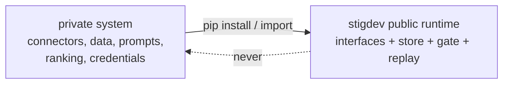

# Integration boundary for private consumers

How a private commercial system (e.g. `social-trend-agent`) consumes this
public runtime without reversing the dependency or leaking private assets.
This document describes contracts only; no private code, data, or behavior is
referenced anywhere in this repository.

## Direction

Private -> public only. The public runtime must remain fully functional and
testable with zero private assets (enforced today: offline provider, synthetic
fixtures, no network).

## Current seams and extension status (all in `stigdev/`)

| Contract/seam | Where | Current status | Private implementation examples (never committed here) |
|---|---|---|---|
| `Provider`: `generate(ProviderRequest) -> ProviderResponse` | `provider.py` | Protocol exists, but `runtime.run` constructs only offline/Ollama providers; generic factory injection is future work. | Paid model adapter, private prompt assembly |
| `Sandbox`: `call(path, entrypoint, args, timeout) -> SandboxResult` | `sandbox.py` | Protocol exists, but the main runtime currently constructs `SubprocessSandbox` directly. | Containerized or remote execution |
| Evaluator-shaped `evaluate(store, artifact_hash, split, k) -> Evidence` | `evaluator.py` | Concrete TrendEvoBench evaluator is wired into the run loop; a public registry/factory is not implemented. | Evaluators over private fixtures/metrics |
| Fixture JSONL shape (public fields `id,text,source,ts,engagement`; truth fields evaluator-side) | `evaluator.py` | Implemented for TrendEvoBench v1/v2; it is a Python-enforced shape, not a standalone versioned JSON Schema. | Private data mapped in the private repo |
| Run store layout (`events.jsonl`, `artifacts/`, `canonical.json`, `manifest.json`) | `store.py` | Implemented, file-backed, and consumed by replay; the flat event envelope is not yet schema-versioned. | Private read-only dashboards/consumers |
| `RunConfig` dataclass JSON representation | `model.py` | Implemented via `from_dict`/`to_dict`; no separately published JSON Schema. | Private experiment config generation |

These are the current architectural seams, not all production-ready plugin
points. A private consumer must not monkey-patch the public run loop to hide
behavior. Generic dependency injection or registries require a reviewed public
contract and offline tests first.

## Execution contracts and future operational boundaries

The ADR 0005 offline contract phase is implemented locally:

- `Provider` remains model inference only.
- `AgentExecutor.execute(ExecutionRequest)` returns a validated attempt result;
  only a deterministic fake is provided, without real process supervision.
- `WorkspaceBackend` exposes create/resolve, prepare, inspect, retain/dispose;
  only an in-memory fake is provided.
- `execute_agent` accepts these implementations and an existing `RunStore`.
  It records execution evidence without scheduling, evaluating, or promoting.
- `GatewayAdapter` remains future design, as do real Claude Code, Codex CLI,
  OpenCode, Hermes, Slack, Git, container, and remote adapters.

Organization-specific gateway routing, credentials, and deployment policy
belong in a private consumer or a future control-plane repository. Public
contracts and deterministic executor/workspace fakes are documented in
`docs/execution_contracts.md`. Instructions, explicit environments, locators,
and raw logs stay transient; public metadata and artifact contents remain the
caller's responsibility. No general permission or budget enforcement exists.
See `docs/agentic_engineering_os_architecture.md` for later boundaries.

## Rules for private consumers

1. Implement only approved public interfaces in the private repository; never
   patch, fork, or monkey-patch public modules to embed hidden private behavior.
2. Never commit fixtures derived from scraped or customer data here — not even
   "anonymized" samples.
3. Private evaluators/providers keep their own version identifiers; runs mixing
   private components are not comparable to public benchmark runs and must not
   be published as such.
4. Credentials live only in the private deployment environment. The public
   runtime reads no environment secrets and must stay that way.
5. Upstreaming a private improvement requires re-deriving it against synthetic
   fixtures and passing the public test suite.
